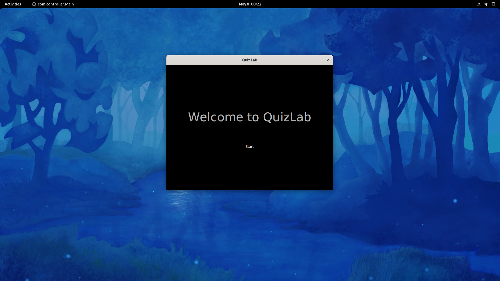
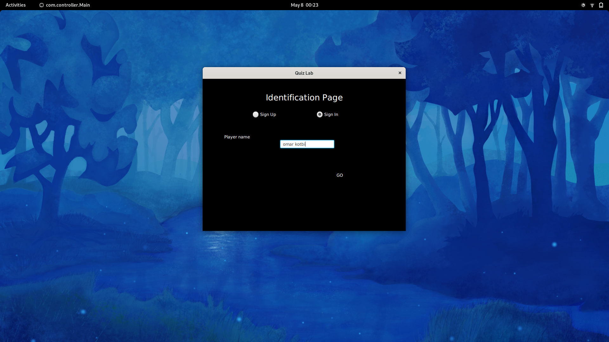
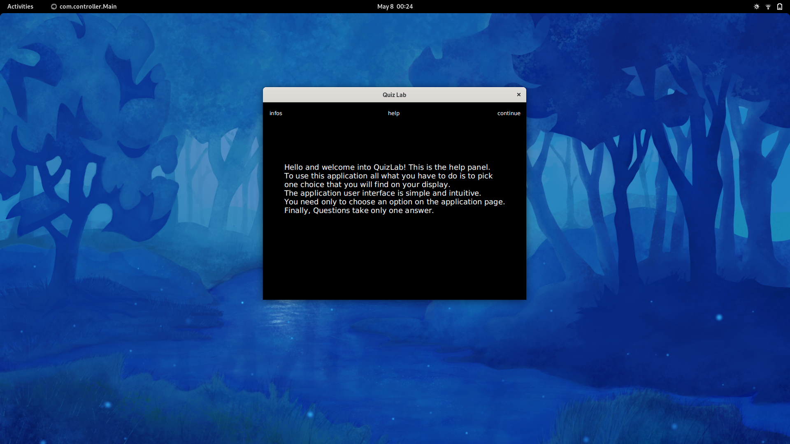
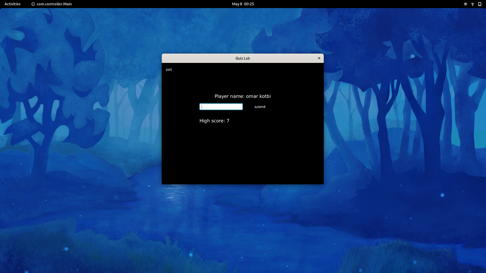
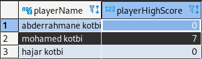

# QuizLab

   


> Welcome to QuizLab, a simple desktop quiz application in java.

## Presentation

This application gives a simple quiz for the user and manage user's information and score.

Firstly, the user sign in or sign up. Then, the user can start the game.

The data is stored in `sqlite3 database`, to make adding users or changing questions easy for the code owner.

Also, the application is built using java fx. It is easy and intuitive to use. We used [Gulon scene builder](https://gluonhq.com/products/scene-builder/#download) to build the UI.

---

## Execution

To use this code please run:

```sh
$ mvn javafx:run --file pom.xml
```

---

## How to use this application

1. After running the application you will find a welcome page:

2. Then you will need either to sign in or to sign up:

3. After identification you can demande help:

4. Now you can start a play:

5. After That you can demande help again:

6. Also, you can update your information:


---

## Initial testing Database

To run provided tests successfully I recommand to use the provided database:


Otherwise, you can update your own tests data.

---

⚓ Please refer to the github repo [QuizLab](https://github.com/abdorah/QuizLab) for the console version.